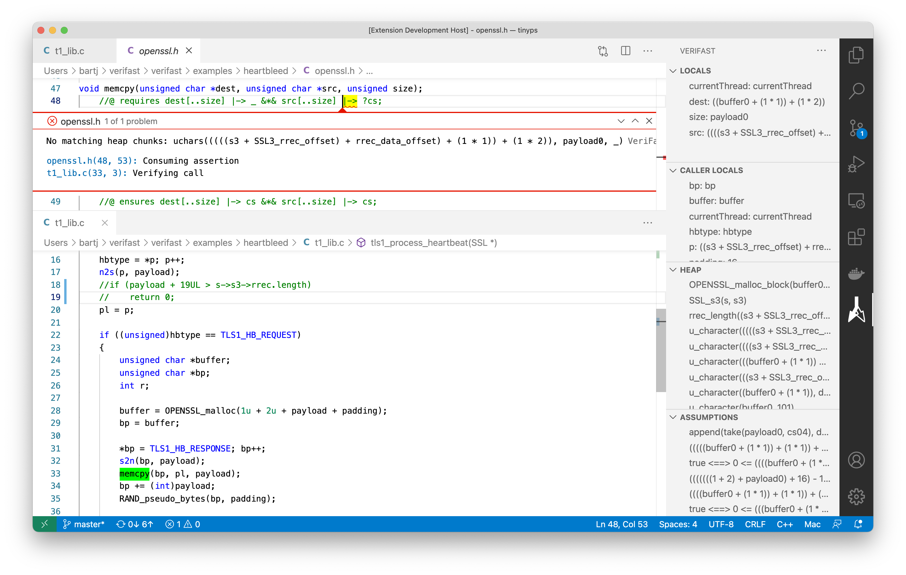

# VeriFast

[VeriFast](https://github.com/verifast/verifast) is a research prototype of a modular formal verification tool for C, Java, and Rust programs. It takes as input a `.c`, `.java`, or `.rs` file annotated with function/method preconditions and postconditions, loop invariants, data structure descriptions, mathematical definitions, and proof hints, and symbolically executes each function/method, using a separation logic-based representation of memory, to check that it complies with its specification. If the tool reports "0 errors found" then, barring bugs in the tool, this means that every possible execution of the program is free of illegal memory accesses and data races and complies with the provided specifications.

This extension provides support for running VeriFast from Visual Studio Code.

## Features

Issue the **Verify with VeriFast** command (bound by default to Shift+Alt+V) to run VeriFast on the active `.c`, `.java`, or `.rs` file. If VeriFast encounters a symbolic execution failure, the symbolic state at the time of failure is shown in the sidebar, and both the source location of the failure and the call site (if applicable) are highlighted and shown.



To set command-line options, specify them on the first line of your `.c`, `.java`, or `.rs` file. For example:

```c
// verifast_options{disable_overflow_check prover:z3v4.5 target:Linux64}
```

Other commands:
- **Verify function with VeriFast** (Shift+Alt+M)
- **VeriFast: Run to cursor** (Shift+Alt+C)
- **Clear VeriFast trace** (Shift+Alt+L)
- **Show VeriFast execution tree** (Shift+Alt+T)

## Requirements

You need to install VeriFast itself separately. Download the [latest nightly build](https://github.com/verifast/verifast#binaries), extract it to any location on your machine, and configure the path to the VeriFast command in your VSCode settings (Settings -> Extensions -> VeriFast).

## Extension Settings

This extension contributes the following settings:

* `verifast.verifastCommandPath`: path to the VeriFast command-line tool

## Syntax Highlighting for VeriFast Annotations

To get syntax highlighting for VeriFast annotations, insert the following into your `settings.json` file (Preferences -> Settings -> Open Settings (JSON)) (but see the known issues below):
```json
    "editor.tokenColorCustomizations": {
        "textMateRules": [
            {
                "scope": "verifast-c-ghost-range",
                "settings": {
                    "foreground": "#CC6600"
                }
            },
            {
                "scope": "verifast-c-ghost-keyword",
                "settings": {
                    "fontStyle": "bold",
                    "foreground": "#DB9900"
                }
            },
            {
                "scope": "verifast-c-ghost-range-delimiter",
                "settings": {
                    "foreground": "#808080"
                }
            },
            {
                "scope": "verifast-rust-ghost-range",
                "settings": {
                    "foreground": "#CC6600"
                }
            },
            {
                "scope": "verifast-rust-ghost-keyword",
                "settings": {
                    "fontStyle": "bold",
                    "foreground": "#DB9900"
                }
            },
            {
                "scope": "verifast-rust-ghost-range-delimiter",
                "settings": {
                    "foreground": "#808080"
                }
            }
        ],
    }
```

## Known Issues

Known TODO items:
- In `.c` files, indented multiline annotations are not recognized as VeriFast ghost ranges
- In `.rs` files, rust-analyzer's assignment of semantic token type 'Comment' to comment tokens overrides the VeriFast ghost range color
- Browse VeriFast built-in header files
- Code completion inside annotations

## Release Notes

### 0.9.8 - 2025-09-04

Fixed a problem that prevented the extension from loading on Windows.

### 0.9.7 - 2025-09-04

The extension now offers to download VeriFast if it does not find an existing installation.

### 0.9.6 - 2025-08-31

- If VeriFast reports an error in a file other than the active one, the extension now makes it active
- The extension now properly clears the old trace and old problem views upon a new verification run
- If the file being verified is in a Cargo package, VeriFast now runs `cargo verifast` instead of `verifast`, so that the correct root source file and correct `rustc` command-line arguments are used.

### 0.9.5 - 2025-01-15

- Fixed a regression caused by the 0.9.4 release: parse errors reported by VeriFast were no longer shown [#5](https://github.com/verifast/verifast-vscode/issues/5).
- `-allow_assume` is now passed on the VeriFast command line.

### 0.9.4 - 2024-11-26

Expose Quick Fixes [generated by VeriFast](https://github.com/verifast/verifast/commit/4c04a33b0a19d92962ff39d92b0253186940c0d6).

### 0.9.3 - 2024-10-24

**Clear VeriFast trace** now also clears the diagnostics.

### 0.9.2 - 2023-03-01

Enabled verification of `.rs` files. (Note: for now, this is for our internal use only; VeriFast for Rust is currently under development and we have not yet released it.)

### 0.9.1 - 2022-12-12

Added the **Verify function with VeriFast** command.

Fixed [crashes due to dead code errors](https://github.com/verifast/verifast-vscode/issues/2).

### 0.9.0 - 2022-12-01

Added the Steps view, branch decorations, syntax highlighting of annotations, and the **VeriFast: Run to cursor**, **Clear VeriFast trace** and **Show VeriFast execution tree** commands. Also, VeriFast now supports specifying most relevant command-line options on the first line of the source file.

### 0.2.0 - 2021-01-21

Added *Go to Definition* support. Requires support from VeriFast, so make sure to use the latest VeriFast build.

### 0.1.0 - 2021-01-15

Initial release.